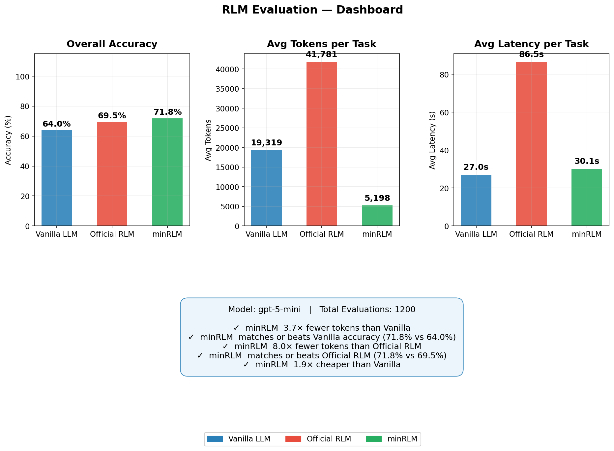
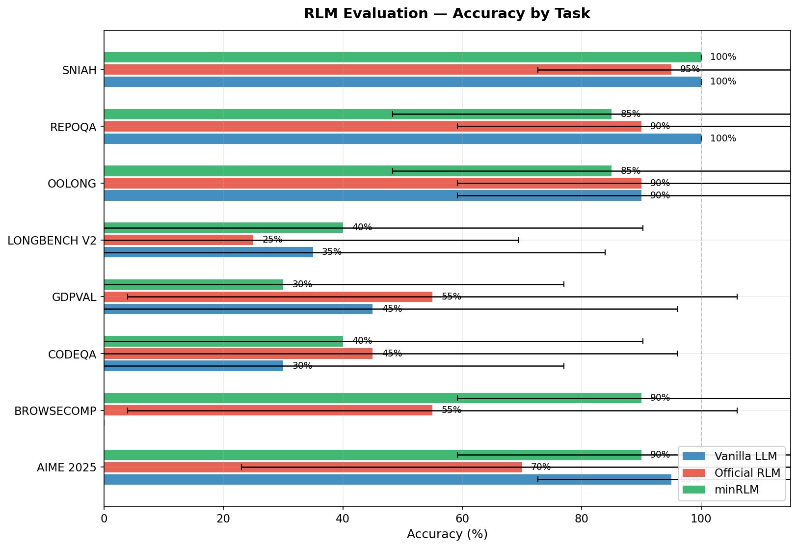
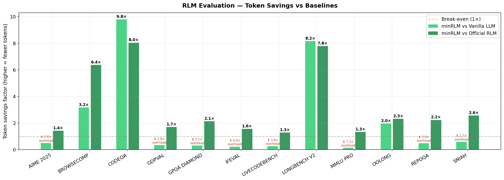
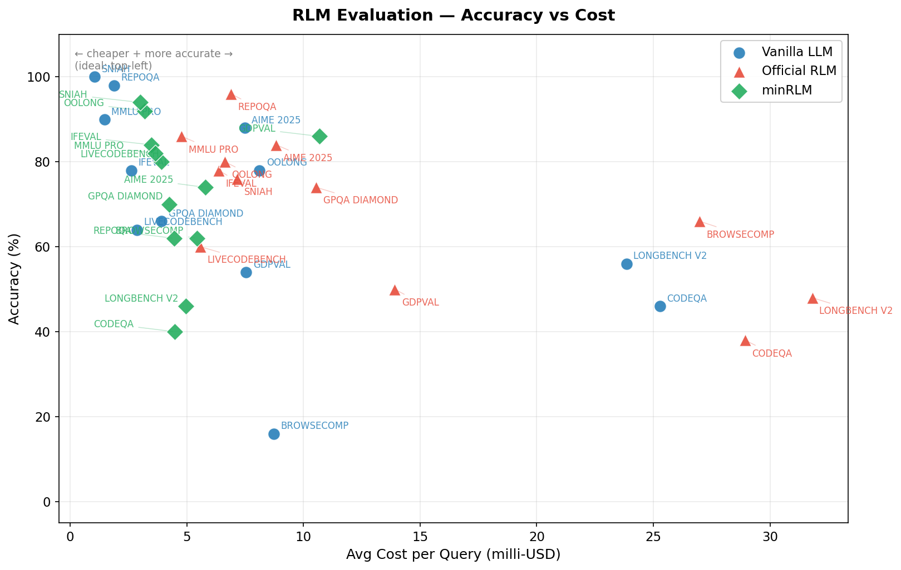
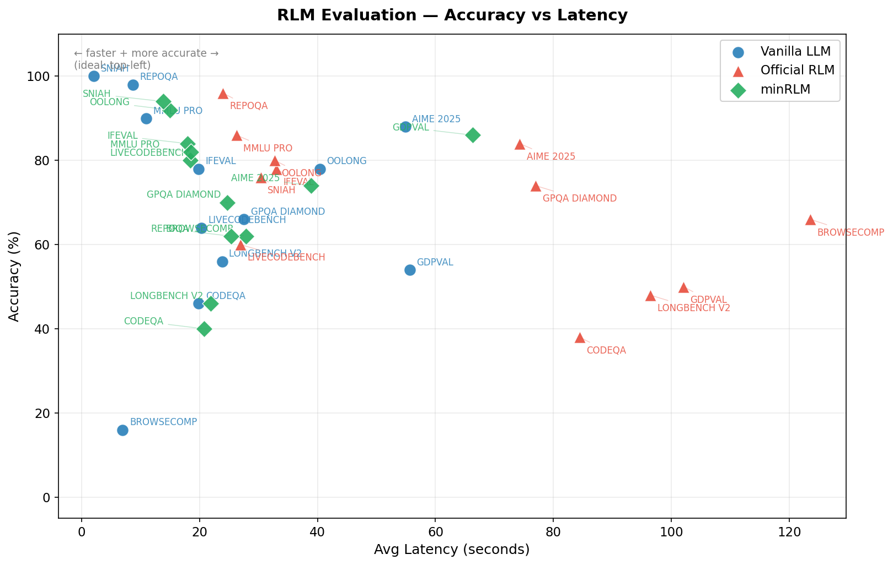
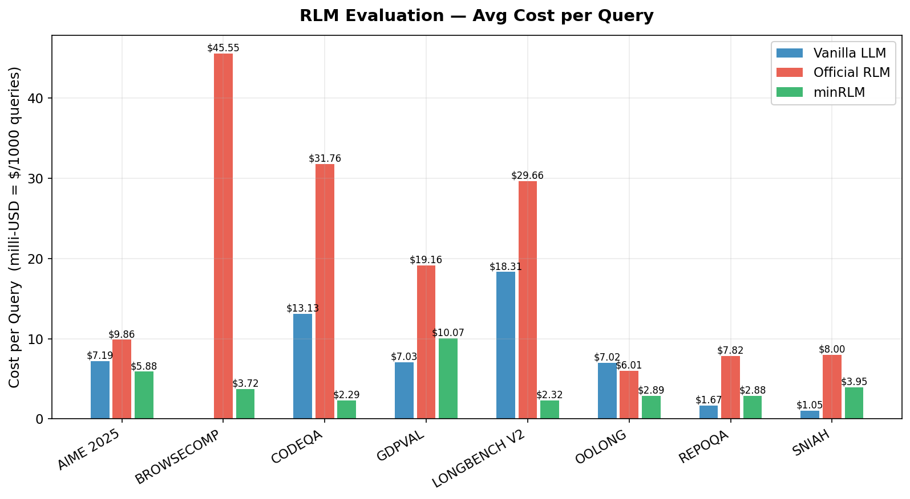

# minrlm

**minRLM** is a token-efficient implementation of [Recursive Language Models](https://arxiv.org/abs/2512.24601). The data never enters the prompt. The cost stays flat regardless of context size. Every step is Python code you can read, rerun, and debug.

**[Read the full blog post](https://avilum.github.io/minrlm/recursive-language-model.html)** - 12 tasks, 3 models, 4,800 evaluations, all the details.

## Results

|  | minRLM | Vanilla | Official RLM |
|---|---|---|---|
| **Accuracy** | **72.7%** | 69.5% | 69.7% |
| **Tokens/query** | **8,151** | 20,967 | 29,327 |
| **Cost (600 evals)** | **$2.86** | $4.74 | $7.92 |

<sub>GPT-5-mini, 1,800 evaluations, 12 tasks, 50 runs each. Full per-task breakdown in [`eval/README.md`](eval/README.md).</sub>

### Model scaling

| Model | minRLM | Vanilla | Delta | Tasks won |
|-------|--------|---------|-------|-----------|
| GPT-5-nano | 53.7% | 63.2% | -9.5 | 4/12 |
| GPT-5-mini | 72.7% | 69.5% | +3.2 | 7/12 |
| GPT-5.2 | **78.2%** | 48.2% | **+30.0** | **11/12** |

The advantage grows with model capability. Details in the [blog](https://avilum.github.io/minrlm/recursive-language-model.html#scaling).

| | | |
|---|---|---|
|  |  |  |
|  |  |  |

---

## Quick start

```bash
pip install minrlm   # or: uv add minrlm
export OPENAI_API_KEY="sk-..."
```

### CLI (zero-install)

```bash
# Just a task
uvx minrlm "What is the sum of the first 100 primes?"

# Task + file as context
uvx minrlm "How many ERROR lines in the last hour?" ./server.log

# Pipe context from stdin
cat huge_dataset.csv | uvx minrlm "Which product had the highest return rate?"

# Show generated code (-s) and token stats (-v)
uvx minrlm -sv "Return the sum of all primes up to 1,000,000."
# -> Sieve of Eratosthenes in 6,215 tokens, 1 iteration
# -> Answer: 37550402023

uvx minrlm -sv "Return all primes up to 1,000,000, reversed. Return a list of numbers."
# -> 999983, 999979, 999961, 999959, 999953, ...
# -> Tokens: 6,258 | Output: 616,964 chars (~154K tokens) | 25x savings
```

### Visualizer

```bash
git clone https://github.com/avilum/minrlm && cd minrlm
uv sync --extra visualizer
uv run python examples/visualizer.py   # http://localhost:7860
```

### Python

```python
from minrlm import RLM

client = RLM(model="gpt-5-mini")

# Large context - data never enters the prompt
answer = client.completion(
    task="Which product had the highest return rate in Q3?",
    context=open("q3_returns.csv").read()  # could be 50MB
)

# No context - the REPL computes via code
result = client.completion(
    "Return all prime numbers up to 1,000,000, reversed. Return a list of numbers."
)
# Output: 999983, 999979, 999961, 999959, 999953, ...
# Tokens used: 6,258 | Output chars: 616,964 (~154K tokens) | Savings: 25x
```

### REPL tools

| Function | What it does |
|----------|--------------|
| `input_0` | Your context data (string) |
| `search(text, pattern)` | Substring search with context windows |
| `sub_llm(task, context)` | Recursive LLM call on a sub-chunk |
| `FINAL(answer)` | Return answer and stop |

### Any OpenAI-compatible endpoint

minRLM works with any provider that exposes an OpenAI-compatible API - just pass `base_url`, or inject your own `OpenAI` client:

```python
# Local / self-hosted
rlm = RLM(model="llama-3.1-70b", base_url="http://localhost:8000/v1")

# Hugging Face Inference API
from openai import OpenAI

hf_client = OpenAI(base_url="https://router.huggingface.co/v1", api_key="hf_...")
rlm = RLM(model="openai/gpt-oss-120b", client=hf_client)
result = rlm.completion("How many g's in 'huggingface'?")
```

Works with: OpenAI, Hugging Face, Anthropic (via proxy), vLLM, Ollama, LiteLLM, or anything OpenAI-compatible. See [`examples/huggingface_inference_endpoints.py`](examples/huggingface_inference_endpoints.py) for a full example.

---

## What's in this repo

| Component | Location | Description |
|-----------|----------|-------------|
| **Client** | [`minrlm/`](minrlm/) | `RLM` class - the LLM <-> REPL loop |
| **DockerREPL** | [`minrlm/docker_repl.py`](minrlm/docker_repl.py) | Sandboxed execution via Docker + seccomp |
| **Evals** | [`eval/`](eval/) | 12-task benchmark framework, 3 model sizes |
| **Examples** | [`examples/`](examples/) | Quickstart, proxy server, Gradio UI |

### DockerREPL

LLM-generated code runs in isolated Docker containers. Docker is auto-detected. No network, read-only filesystem, memory-capped, seccomp-filtered.

```python
client = RLM(model="gpt-5-mini", use_docker=True, docker_memory="256m")
```

### Evals

```bash
git clone https://github.com/avilum/minrlm && cd minrlm
uv sync --extra eval

# Smoke test
uv run python eval/quickstart.py

# Full benchmark (reproduces the table above)
uv run python eval/run.py \
    --tasks all \
    --runners minrlm-reasoning,vanilla,official \
    --runs 50 --parallel 12 --task-parallel 12 \
    --output-dir logs/my_eval
```

Full results, per-task breakdowns, reproduction steps: [`eval/README.md`](eval/README.md)

### Examples

```bash
uv run python examples/minimal.py              # vanilla vs RLM side-by-side
uv run python examples/advanced_usage.py        # search, sub_llm, callbacks
uv run python examples/visualizer.py            # Gradio UI (uv sync --extra visualizer)
uv run uvicorn examples.proxy:app --port 8000   # OpenAI-compatible proxy (uv sync --extra proxy)
```

---

## Credits

Built by [Avi Lumelsky](https://github.com/avilum). Independent implementation - not a fork. 
The RLM concept comes from [Zhang, Kraska, and Khattab (2025)](https://arxiv.org/abs/2512.24601). Official implementation: [github.com/alexzhang13/rlm](https://github.com/alexzhang13/rlm).
```
@misc{zhang2026recursivelanguagemodels,
      title={Recursive Language Models},
      author={Alex L. Zhang and Tim Kraska and Omar Khattab},
      year={2026},
      eprint={2512.24601},
      archivePrefix={arXiv},
      primaryClass={cs.AI},
      url={https://arxiv.org/abs/2512.24601},
}
```

## Star History

<a href="https://www.star-history.com/?repos=avilum%2Fminrlm&type=date&legend=top-left">
 <picture>
   <source media="(prefers-color-scheme: dark)" srcset="https://api.star-history.com/image?repos=avilum/minrlm&type=date&theme=dark&legend=top-left" />
   <source media="(prefers-color-scheme: light)" srcset="https://api.star-history.com/image?repos=avilum/minrlm&type=date&legend=top-left" />
   
 </picture>
</a>

## License

MIT
