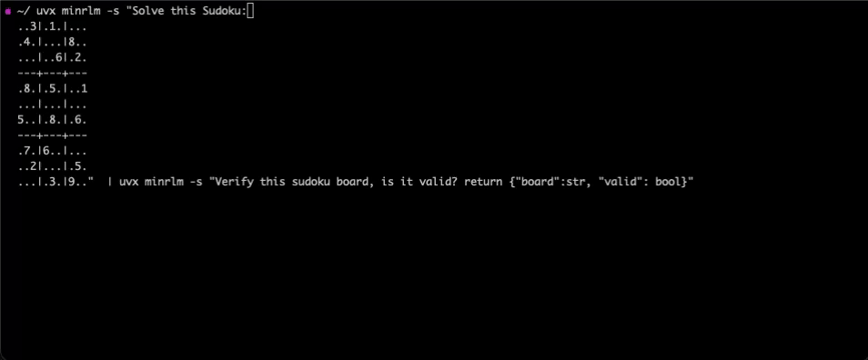
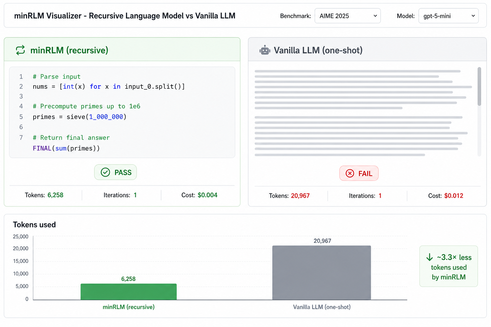

<p align="center">
  <h1 align="center">minRLM</h1>
  <p align="center">
    <b>A small Recursive Language Model that lets any LLM run code on its context instead of stuffing it into the prompt.</b><br>
    <sub>Independent implementation of <a href="https://arxiv.org/abs/2512.24601">Zhang, Kraska &amp; Khattab (2025)</a>. 6,600 evaluations across 4 models and 12 tasks. Full reproduction scripts and an interactive visualizer included.</sub>
  </p>
  <p align="center">
    <a href="https://pypi.org/project/minrlm/"></a>
    <a href="https://github.com/avilum/minrlm/stargazers"></a>
    <a href="https://github.com/avilum/minrlm/blob/master/LICENSE"></a>
    <a href="https://avilum.github.io/minrlm/recursive-language-model.html"></a>
    <a href="eval/BENCHMARK.md"></a>
  </p>
</p>

<table align="center" width="100%">
  <tr>
    <td width="50%" align="center">
      <a href="#how-it-works">
        
      </a>
      <sub><b>The CLI</b> — the LLM writes Python, a REPL runs it, the answer comes back.</sub>
    </td>
    <td width="50%" align="center">
      <a href="#visualizer">
        
      </a>
      <sub><b>The Visualizer</b> — see minRLM and a vanilla LLM run the same task, side-by-side, on any benchmark.</sub>
    </td>
  </tr>
</table>

The idea is small and not new: instead of forcing one giant prompt through the model, let it **generate code → execute → refine → repeat**. The model doesn't change, the training doesn't change, the data doesn't change. The control loop does.

This repo is a minimal, reproducible take on that idea, plus a benchmark — [**RLM-Bench**](eval/BENCHMARK.md) — that you can run against your own RLM.

---

## Try it in 10 seconds

```bash
pip install minrlm
export OPENAI_API_KEY="sk-..."

# Analyze a file - the data never enters the prompt
uvx minrlm "How many ERROR lines in the last hour?" ./server.log

# Pure computation - the REPL writes the algorithm
uvx minrlm "Return all primes up to 1,000,000, reversed."
# -> 78,498 primes in 6,258 tokens. Output: 616K chars. ~25x output-to-token savings.

# Pipe anything
cat huge_dataset.csv | uvx minrlm "Which product had the highest return rate?"

# Chain: solve a Sudoku, then pipe the solution to a verifier
uvx minrlm -s "Solve this Sudoku:
  ..3|.1.|...
  .4.|...|8..
  ...|..6|.2.
  ---+---+---
  .8.|.5.|..1
  ...|...|...
  5..|.8.|.6.
  ---+---+---
  .7.|6..|...
  ..2|...|.5.
  ...|.3.|9.." \
  | uvx minrlm -s 'Verify this sudoku board, is it valid? return {"board":str, "valid": bool}'
```

```python
from minrlm import RLM

rlm = RLM(model="gpt-5-mini")

# 50MB CSV? Roughly the same cost as 5KB. The data never enters the prompt.
answer = rlm.completion(
    task="Which product had the highest return rate in Q3?",
    context=open("q3_returns.csv").read(),
)
```

Want to *see* what's happening instead of reading it? Jump to the [Visualizer](#visualizer).

---

## Headline numbers

The same eval suite ([RLM-Bench](eval/BENCHMARK.md)) was run on 4 OpenAI models, 12 tasks, 50 runs per task per runner. Numbers below are aggregates across the full task set. None of this is cherry-picked — losses are kept in.

| Model | Accuracy (minRLM vs vanilla) | Δ accuracy | Cost — 600 evals (minRLM vs vanilla) | Cost change | Tokens/query (minRLM vs vanilla) | Token savings |
|---|---|---|---|---|---|---|
| GPT-5-nano | 53.7% vs **63.2%** | **−9.5pp** | **$0.74** vs $1.16 | **1.6× cheaper** | **13,811** vs 18,137 | 1.3× |
| GPT-5-mini | **72.7%** vs 69.5% | **+3.2pp** | **$2.86** vs $4.74 | **1.7× cheaper** | **8,151** vs 20,967 | **2.6×** |
| GPT-5.4-mini | **69.5%** vs 47.2% | **+22.3pp** | $7.23 vs **$7.15** | ≈ parity | **9,388** vs 15,072 | 1.6× |
| GPT-5.2 | **78.2%** vs 48.2% | **+30.0pp** | $18.93 vs **$16.50** | +14.7% more | **8,096** vs 14,196 | 1.8× |

**The honest read.** minRLM wins on accuracy across the three mid- and frontier-tier models. It loses on the smallest model (the REPL overhead isn't worth it when the model can't reliably write the code). On cost, it's cheaper or roughly tied on the smaller models, slightly more expensive on the strongest model — the extra cost buys +30pp of accuracy. The one number that's consistent across every model and every task is the **token reduction** (1.3×–2.6× per query), which compounds at scale.

Two examples where the gap is most visible:

| Task | Vanilla (one-shot) | minRLM (recursive) | Gap |
|---|---|---|---|
| AIME 2025 — GPT-5.2 | 0% | **96%** | +96pp |
| Sudoku Extreme — GPT-5.2 | 0% | **80%** | +80pp |

Per-model and per-task breakdowns: [eval/BENCHMARK.md](eval/BENCHMARK.md). Full write-up: [blog post](https://avilum.github.io/minrlm/recursive-language-model.html).


---

## Visualizer

<p align="center">
  <a href="examples/visualizer.py"></a>
</p>

A Gradio app that runs minRLM and a vanilla LLM on the same task, side-by-side. You see:

- **Every benchmark from RLM-Bench** in a dropdown — auto-discovered from the task registry, plus scaling variants of SNIAH, CodeQA and BrowseComp from 8K up to 10M characters.
- **The generated Python**, line by line, as it streams in.
- **Live token / cost / iteration counters** for both runners.
- **The output**, including pass/fail vs the ground truth.

```bash
git clone https://github.com/avilum/minrlm && cd minrlm
uv sync --extra visualizer
uv run python examples/visualizer.py   # opens http://localhost:7860
```

It's the fastest way to get an intuition for *when the recursive loop helps and when it doesn't*. Drop in your own model with `--base-url` and `--api-key` flags.

---

## How it works

```
Standard LLM:
  [System prompt] + [500K tokens of raw context] + [Question]
  = Expensive. Slow. Accuracy degrades as the context grows.

minRLM:
  input_0 = "<500K chars in REPL memory>"     # never in the prompt
  LLM writes: errors = [l for l in input_0.splitlines() if "ERROR" in l]
              FINAL(len(errors))
  = Code runs. Answer returned. ~4K tokens total.
```

The model writes Python to query the data. Attention only ever runs on the *results* of that code, not the data itself. A 7M-character document costs roughly the same as a 7K one.

**Not ReAct.** One REPL, 1–2 iterations, no growing chat history. Every step is Python you can read, rerun, and debug.

### What's actually in the loop

- **Entropy profiling** — a zlib-compression heatmap of the input. A needle in 7MB shows up as an entropy spike; the model jumps straight to it.
- **Task routing** — auto-detects structured data, MCQ, code retrieval, math, search-and-extract. Each gets a specialised code pattern.
- **Two-pass search** — if the first pass returns "unknown", a second pass runs with keywords extracted from the first-pass evidence.
- **Sub-LLM delegation** — the outer model gathers evidence via `search()`, then hands it to `sub_llm(task, evidence)` for focused reasoning on a smaller chunk.
- **Flat token cost** — context never enters the conversation. Only the entropy map and a head/mid/tail preview do.
- **DockerREPL** — every execution runs in a sandboxed container with seccomp. No network, no filesystem, stdlib only.

---

## RLM-Bench

The eval suite that produced the numbers above is shipped as a standalone benchmark you can run, extend, or submit to. Full spec: **[eval/BENCHMARK.md](eval/BENCHMARK.md)**.

```bash
pip install "minrlm[eval]"
export OPENAI_API_KEY="sk-..."

# Smoke test - 1 task, ~30 seconds
rlm-bench --tasks official_sniah --runs 3

# Full benchmark (12 tasks x 3 runners x 50 runs - reproduces the headline numbers)
rlm-bench \
    --tasks all \
    --runners minrlm-reasoning,vanilla,official \
    --runs 50 --parallel 12 --task-parallel 12 \
    --output-dir logs/my_eval
```

### Plug in your own RLM

The runner interface is one method. Subclass `BaseRunner`, decorate with `@register_runner`, and you appear in `--runners`.

```python
from eval.runners import BaseRunner, RunResult, register_runner

@register_runner("my-rlm")
class MyRLMRunner(BaseRunner):
    def run(self, task: str, context: str) -> RunResult:
        # call your RLM here
        ...
        return RunResult(response=answer, total_tokens=tokens, iterations=k)
```

```bash
uv run python eval/run.py --runners my-rlm,vanilla --tasks all
```

### The 12 tasks

Pulled from the RLM paper plus one constraint-satisfaction puzzle: SNIAH, OOLONG, RepoQA, CodeQA, BrowseComp+, LongBench-v2, GDP Val, AIME 2025, GPQA Diamond, MMLU-Pro, IFEval, LiveCodeBench (Sudoku Extreme is also registered and used in the demo). Datasets and licensing notes are in [eval/BENCHMARK.md](eval/BENCHMARK.md).

---

## REPL tools

| Function | What it does |
|----------|--------------|
| `input_0` | Your context data (string, never in the prompt) |
| `search(text, pattern)` | Substring search with context windows |
| `sub_llm(task, context)` | Recursive LLM call on a sub-chunk |
| `FINAL(answer)` | Return answer and stop |

---

## Works with any OpenAI-compatible endpoint

```python
# Local / self-hosted
rlm = RLM(model="llama-3.1-70b", base_url="http://localhost:8000/v1")

# Hugging Face
from openai import OpenAI
hf = OpenAI(base_url="https://router.huggingface.co/v1", api_key="hf_...")
rlm = RLM(model="openai/gpt-oss-120b", client=hf)
```

Tested with: OpenAI, Hugging Face, Anthropic (via proxy), vLLM, Ollama, LiteLLM, or anything OpenAI-compatible.

---

## More ways to run

<details>
<summary><b>OpenCode integration</b></summary>

**1. Start the proxy:**
```bash
uv run --with ".[proxy]" examples/proxy.py
# RLM Proxy initialized | model=gpt-5-mini | docker=False
# Uvicorn running on http://0.0.0.0:8000
```

**2. Config**: in your `opencode.json`, point `provider.minrlm.api` at `http://localhost:8000/v1`. Full walkthrough: [docs/opencode-minrlm-tutorial.md](docs/opencode-minrlm-tutorial.md).

**3. Run:**
```bash
OPENCODE_CONFIG=opencode.json opencode run "First prime after 1 million"
# > 1000003
```

**[Full tutorial](docs/opencode-minrlm-tutorial.md)**
</details>

<details>
<summary><b>Docker sandbox</b></summary>

LLM-generated code runs in isolated Docker containers. No network, read-only filesystem, memory-capped, seccomp-filtered.

```python
rlm = RLM(model="gpt-5-mini", use_docker=True, docker_memory="256m")
```
</details>

<details>
<summary><b>Examples</b></summary>

```bash
uv run python examples/minimal.py            # vanilla vs RLM side-by-side
uv run python examples/advanced_usage.py     # search, sub_llm, callbacks
uv run python examples/visualizer.py         # Gradio UI
uv run uvicorn examples.proxy:app --port 8000  # OpenAI-compatible proxy
```
</details>

---

## Why this might matter

[Context window rot](https://arxiv.org/abs/2509.21361) is well-documented — model accuracy degrades as input grows, even when the answer is right there in the input. Bigger windows don't really fix it. Less input, better targeted, does.

The same pattern keeps showing up: Anthropic's [web search tool](https://docs.anthropic.com/en/docs/build-with-claude/tool-use/web-search-tool) writes code to filter results, [MCP](https://modelcontextprotocol.io/) standardises code-execution access, [smolagents](https://huggingface.co/docs/smolagents/en/index) goes further. They all converge on the same idea: let the model use code to *work with* data instead of attending to all of it.

minRLM is one small, debuggable version of that idea, with a benchmark attached so the trade-offs are out in the open.

---

## Future work

- **More models** — Claude Opus 4.6, Gemini 2.5, open-weight models. Does the scaling trend hold across providers?
- **Agentic pipelines** — using the RLM pattern as a retrieval step inside multi-step agent workflows.
- **More tasks** — stress-testing edge cases and domains where the approach might break.

Contributions welcome — open an issue or PR, or submit a runner to [RLM-Bench](eval/BENCHMARK.md#submitting-results).

---

## Credits

Built by [Avi Lumelsky](https://github.com/avilum). Independent implementation, not a fork.

The RLM concept comes from [Zhang, Kraska, and Khattab (2025)](https://arxiv.org/abs/2512.24601). Official implementation: [github.com/alexzhang13/rlm](https://github.com/alexzhang13/rlm).

<details>
<summary>Citation</summary>

```
@misc{zhang2026recursivelanguagemodels,
      title={Recursive Language Models},
      author={Alex L. Zhang and Tim Kraska and Omar Khattab},
      year={2026},
      eprint={2512.24601},
      archivePrefix={arXiv},
      primaryClass={cs.AI},
      url={https://arxiv.org/abs/2512.24601},
}
```
</details>

## Star history

<a href="https://www.star-history.com/?repos=avilum%2Fminrlm&type=date&legend=top-left">
 <picture>
   <source media="(prefers-color-scheme: dark)" srcset="https://api.star-history.com/image?repos=avilum/minrlm&type=date&theme=dark&legend=top-left" />
   <source media="(prefers-color-scheme: light)" srcset="https://api.star-history.com/image?repos=avilum/minrlm&type=date&legend=top-left" />
   
 </picture>
</a>

## License

MIT
