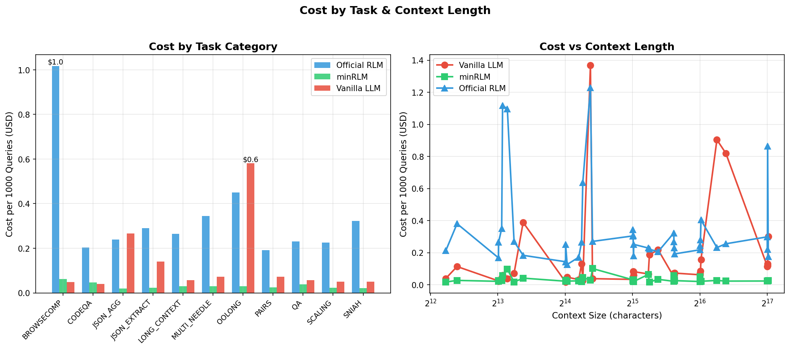
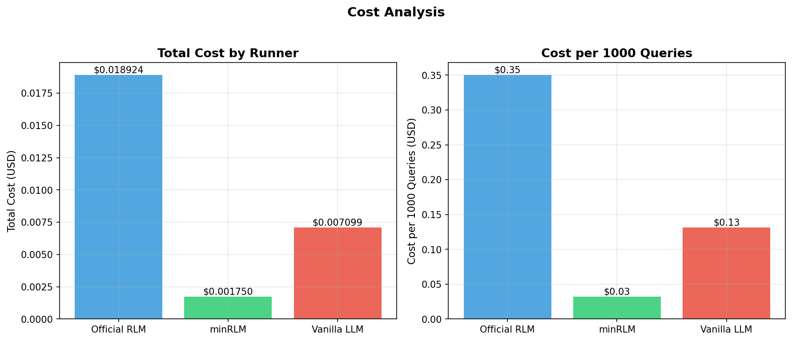
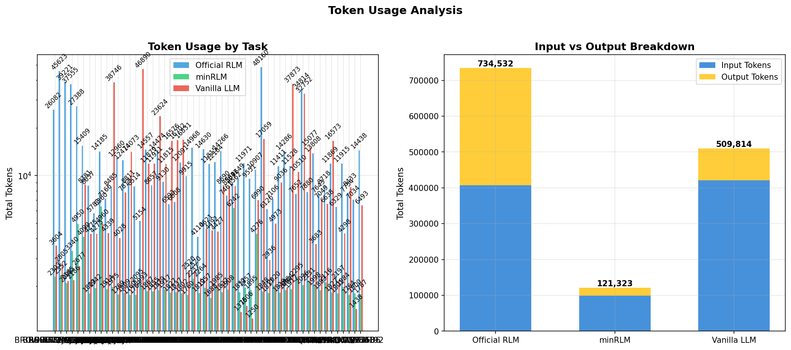

# minrlm

A minimal implementation of [Recursive Language Models](https://arxiv.org/abs/2512.24601) - let LLMs write code instead of reading your data.

**The problem**: A 256K JSON file costs ~93,000 tokens just to find one value.

**The solution**: The model writes code to search it. You pay ~1,000 tokens instead. Same answer, ~90x cheaper.

**The proof**: 4.2x fewer tokens, 4.1x cheaper. At 11M contexts, RLMs work where vanilla LLM fails.

## Quick Start

```bash
uv pip install minrlm
```

```python
from minrlm import RLM

rlm = RLM(model="gpt-5-nano")
result = rlm.completion(
    task="Find employee EMP-0042",
    context=huge_json  # 500K chars, stored as variable
)
print(result.total_tokens)  # ~2K tokens regardless of size
```

## Benchmarks

**Overall**: **4.2x fewer tokens**, **4.1x cheaper**

| Task | Context | Vanilla | minrlm | Savings |
|------|---------|---------|--------|---------|
| JSON Extraction | 131K | 46,890 tokens | 1,993 tokens | **23.5x** |
| JSON Aggregation | 131K | 38,746 tokens (0%) | 1,975 tokens (100%) | **19.6x** |
| BrowseComp+ | 11M | ❌ Fails | ✅ 100% (~2K tokens) | **∞** |

**Key insight**: At large contexts (128K+), RLMs often match or exceed vanilla accuracy while using **10-90x fewer tokens**. At larger scales (6M-11M), RLMs are the only viable option - vanilla fails due to token limits.

### Cost & Token Efficiency







See [`eval/README.md`](eval/README.md) for detailed benchmark analysis.

## How It Works

1. Your context is stored as `input_0` in a Python REPL
2. The model writes code to search/process it
3. Code runs, output goes back to the model
4. Repeat until `FINAL(answer)` is called

```
┌─────────────────────────────────────────────────────────────┐
│  LLM sees:                                                  │
│                                                             │
│  input_0 = "string with 262144 chars"                       │
│  Task: Find employee EMP-0042                               │
├─────────────────────────────────────────────────────────────┤
│  LLM writes:                                                │
│                                                             │
│  data = json.loads(input_0)                                 │
│  for emp in data:                                           │
│      if emp["id"] == "EMP-0042":                            │
│          FINAL(emp["name"])                                 │
└─────────────────────────────────────────────────────────────┘
```

The data never enters the conversation. Token usage stays flat regardless of context size.

## Install

```bash
uv pip install minrlm
```

Or from source:
```bash
git clone https://github.com/avilum/minrlm
cd minrlm && uv sync
```

## Usage

```python
from minrlm import RLM

# Use gpt-4o-mini for simple tasks (fast, cheap)
rlm = RLM(model="gpt-5-nano")

# Or gpt-5-nano for complex multi-step tasks (reasoning enabled)
# rlm = RLM(model="gpt-5-nano")

# No context - model just writes code
result = rlm.completion("Print the first 100 powers of two")
print(result.response)
# 1, 2, 4, 8, 16, ... 633825300114114700748351602688

# With context - data stored as input_0
result = rlm.completion(
    task="Find all employees in Engineering",
    context=massive_json  # 500K chars
)
print(result.total_tokens)  # Typically <2K tokens regardless of context size
```

### What the model generates

```python
# Iteration 1: writes this
for i in range(100):
    print(1 << i)
# → stdout captured, but no FINAL()

# Iteration 2: realizes it needs FINAL()
FINAL("\n".join(str(1 << i) for i in range(100)))
```

### Available functions

| Function | What it does |
|----------|--------------|
| `input_0` | Your context data |
| `search(text, pattern)` | Find matches with surrounding context |
| `peek(data)` | Preview structure of large data |
| `sub_llm(task, context)` | Recursive LLM call on a chunk |
| `FINAL(answer)` | Return the final answer |

The system prompt (~140 lines) can be customized in [`minrlm/prompts.py`](minrlm/prompts.py).

### Custom endpoints

```python
rlm = RLM(
    model="llama-3.1-70b",
    base_url="http://localhost:8000/v1",
    api_key="..."
)
```

## When to use this

| Context size | Recommendation |
|--------------|----------------|
| < 10K chars | Vanilla LLM (faster) |
| 10K - 50K chars | Either works |
| 50K+ chars | minrlm (**typically 20-90x cheaper**) |

**Good for:** Large documents, logs, JSON, anything you'd search/filter/aggregate.

**Skip if:** Context is small, latency matters more than cost, or the task needs holistic understanding of the whole document.

## Model selection

| Model | Best for | Tokens | Speed |
|-------|----------|--------|-------|
| **gpt-5-nano** | Complex tasks (multi-step logic) | More | Slower |
| **gpt-4o-mini** | Simple tasks (direct lookups) | Less | Faster |

Reasoning models (gpt-5, o1, o3) help with complex code generation. Default: `reasoning_effort="low"` to control cost. Tune with `reasoning_effort="high"` for maximum capability.

## Why RLMs?

Traditional LLMs process data through attention - expensive O(n²) operations where the model "reads" your entire document. RLMs keep data in a Python REPL and only send metadata ("200K chars") to the model. The model writes code to search the data, but never sees it.

**The difference**: Agents with code execution still send your 200K document to the model so it can "decide what to do." RLMs don't - they just say "you have `input_0` with 200K chars, write code to search it."

This gives you:
- **Flat token usage** - ~2K tokens regardless of context size
- **Visible transformations** - Python code you can inspect, debug, and reuse
- **O(n) operations** - String processing instead of O(n²) attention

### The Evolution: Why RLMs Are Inevitable

**1. The "Think Step by Step" Era (GPT-3.5)** - Manual prompt engineering, fragile.

**2. Reasoning Models (GPT-5, o1, o3)** - Models reason internally, but you pay for every reasoning token.

**3. Agents: Tools + Reasoning** - Powerful, but context explodes. Every tool call, error, intermediate result goes back into the prompt. Conversations grow from 1K to 100K tokens.

**4. The Context Crisis** - Context windows grew (8K → 1M tokens), but so did costs. We built workarounds: summarize, compress, truncate. Hacks around a fundamental problem.

**5. RLMs: The Inevitable Solution** - Data lives in a REPL, not in the conversation. The model writes code to interact with data, but the data never enters the LLM's context. Token usage stays flat. No hacks. No limits.

**The shift**: From "send data to the model" to "send code from the model." The transformations are visible and reproducible - you get Python code you can inspect, debug, and reuse.

Benchmarks show we're heading in the right direction. At large contexts (128K+), RLMs often match or exceed vanilla accuracy while using 10-90x fewer tokens. At extreme scales (6M-11M), RLMs are the only viable option.


## Running evals

```bash
uv run python eval/run.py --model gpt-5-mini --tasks scaling --runs 1
```

See [`eval/README.md`](eval/README.md) for full benchmark suite.


## Interactive UI

```bash
uv sync --extra visualizer
uv run python examples/visualizer.py
```

Opens a Gradio interface showing token usage and model traces.

## Security - Confined Python REPL with Docker and seccomp

⚠️ This runs LLM-generated Python code. For untrusted inputs, use Docker:

```python
from minrlm import RLM, check_docker_available

# Check if Docker is available
if check_docker_available():
    rlm = RLM(
        model="gpt-5-mini",
        use_docker=True,
        docker_memory="256m",
        docker_timeout=60
    )
```

Docker mode sandboxes execution: no network, memory limits, read-only filesystem. Note: `sub_llm()` isn't available in Docker mode.

<details>
<summary><strong>Custom Seccomp Policy</strong> (click to expand)</summary>

The seccomp profile is defined in [`minrlm/docker_repl.py`](minrlm/docker_repl.py) at lines 54-75. It blocks:
- Network syscalls (socket, connect, bind, etc.)
- Kernel module loading
- Mount operations
- Keyring access
- Process tracing (ptrace)
- System reboot/kexec

To use a custom seccomp policy:

**Option 1: Modify the default profile**
Edit `SECCOMP_PROFILE` in `minrlm/docker_repl.py`:

```python
SECCOMP_PROFILE = {
    "defaultAction": "SCMP_ACT_ALLOW",
    "syscalls": [
        # Add your custom restrictions
        {"names": ["socket"], "action": "SCMP_ACT_ERRNO", "errnoRet": 1},
        # ... more syscalls
    ],
}
```

**Option 2: Extend DockerREPL class**
Create a custom class that overrides the seccomp profile:

```python
from minrlm.docker_repl import DockerREPL, SECCOMP_PROFILE
import json

# Create custom seccomp profile
CUSTOM_SECCOMP = {
    "defaultAction": "SCMP_ACT_ALLOW",
    "syscalls": [
        # Your custom restrictions
        {"names": ["socket"], "action": "SCMP_ACT_ERRNO", "errnoRet": 1},
    ],
}

class CustomDockerREPL(DockerREPL):
    def execute(self, code: str):
        # Override execute method to use custom seccomp
        # See minrlm/docker_repl.py:353-507 for implementation
        # Replace SECCOMP_PROFILE with CUSTOM_SECCOMP at line 388
        pass
```

The seccomp profile is applied via Docker's `--security-opt=seccomp=<path>` flag (see line 408 in `docker_repl.py`). The profile is written to a temporary file and passed to Docker at container creation time.

**Note**: `execve` cannot be blocked as it's required to start the Python interpreter. Process isolation is handled by Docker's `--pids-limit` and container boundaries.

</details>

## OpenAI-Compatible Proxy

Run an RLM proxy server that accepts OpenAI-compatible requests. Drop-in replacement for OpenAI API with automatic RLM routing. This is not production-grade - but a single tool to get started with RLMs.

### Quick Start

```bash
# Install proxy dependencies
uv sync --extra proxy

# Start the proxy server (from examples directory)
cd examples
uvicorn proxy:app --host 0.0.0.0 --port 8000

# Or from project root
uvicorn examples.proxy:app --host 0.0.0.0 --port 8000

# With verbose logging (shows code execution steps)
MINRLM_VERBOSE=1 uvicorn examples.proxy:app --host 0.0.0.0 --port 8000
```

### Configuration

Environment variables:
```bash
export OPENAI_API_KEY="your-key"          # OpenAI API key
export RLM_MODEL="gpt-5-nano"            # Default model
export RLM_USE_DOCKER="true"              # Enable Docker sandboxing
export PORT="8000"                         # Server port
export MINRLM_VERBOSE="1"                 # Enable verbose logging
```

### Usage

Use with any OpenAI-compatible client:

```python
from openai import OpenAI

# Point to RLM proxy instead of OpenAI
client = OpenAI(
    base_url="http://localhost:8000/v1",
    api_key="dummy-key",  # Not used by proxy, but required by client
)

# Works exactly like OpenAI API
response = client.chat.completions.create(
    model="gpt-5-nano",
    messages=[
        {"role": "user", "content": "Print all powers of two until 1 Million"},
    ],
)
print(response.choices[0].message.content)
# Output: 1, 2, 4, 8, 16, 32, 64, 128, 256, 512, 1024, ...
```

### Features

- **Automatic context detection**: Messages with >50K chars are automatically treated as context data
- **Placeholder fallback**: If the model returns a placeholder like "answer", the proxy automatically uses the computed stdout
- **Verbose logging**: Set `MINRLM_VERBOSE=1` to see detailed execution steps, code, and stdout
- **OpenAI-compatible**: Works with any client that supports OpenAI API format
- **Token efficiency**: Automatically routes through RLM for 10-90x fewer tokens on large contexts

### How It Works

1. Receives OpenAI-compatible chat completion requests
2. Extracts task and context from messages (large content >50K chars becomes context)
3. Routes through RLM which writes and executes Python code
4. Returns computed results in OpenAI-compatible format
5. Falls back to stdout if model returns placeholder responses

The proxy automatically extracts large context from messages and routes it through RLM, giving you the same API with 10-90x fewer tokens.

See [`examples/proxy_example.py`](examples/proxy_example.py) for more examples.

## Credits

Based on the (amazing) RLM paper by Zhang, Kraska, and Khattab:

```bibtex
@misc{zhang2025recursivelanguagemodels,
      title={Recursive Language Models}, 
      author={Alex L. Zhang and Tim Kraska and Omar Khattab},
      year={2025},
      eprint={2512.24601},
      archivePrefix={arXiv},
      primaryClass={cs.AI},
      url={https://arxiv.org/abs/2512.24601}, 
}
```

Paper: [arxiv.org/abs/2512.24601](https://arxiv.org/abs/2512.24601)  
Official implementation: [github.com/alexzhang13/rlm](https://github.com/alexzhang13/rlm)

## License

MIT

## Personal note 
> I am a security researcher. This is far from secure - but this is fucking cool!
> I recommend using it with docker backends (default if Docker is installed) because it uses custom seccomp policies that block network and most processing syscalls. Keep the LLM's REPL seperated and confined.
> Bonus: You can use gVisor as docker runtime.