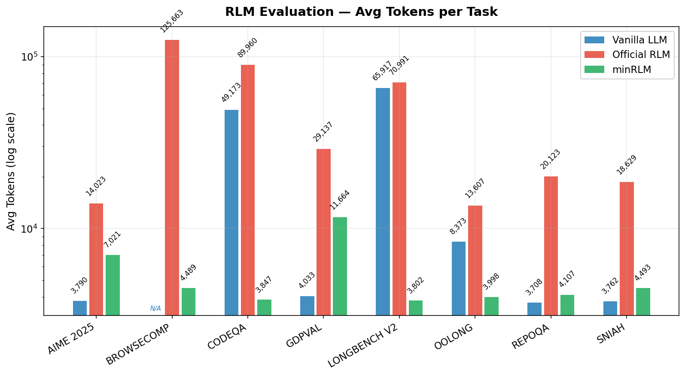
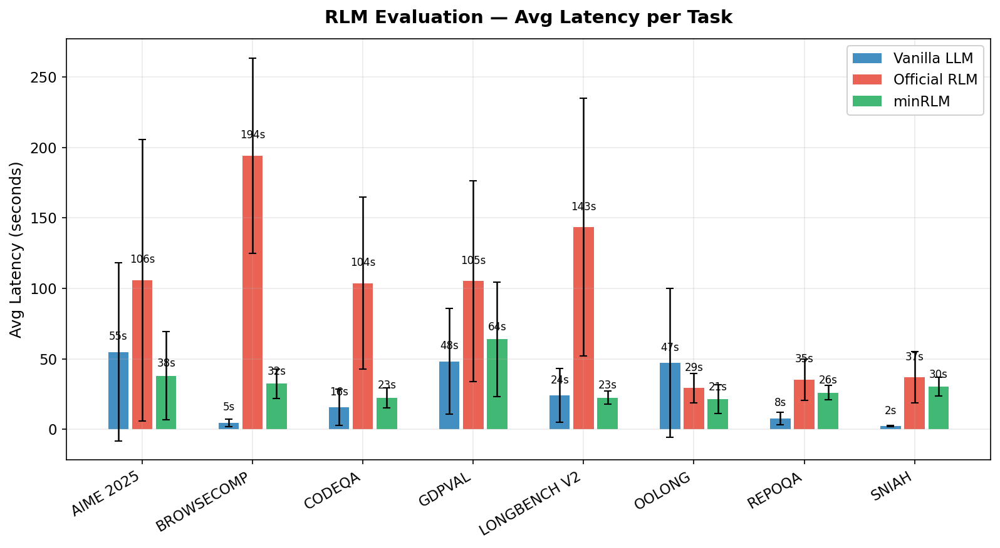

# Benchmark Results

**Model**: gpt-5-mini | **Evaluations**: 1,200 | **Tasks**: 8 | **Iterations**: 50 per task per runner | **Date**: 2026-03-02

Three runners compared: **minRLM** (this implementation), **Vanilla** (direct LLM call), **Official RLM** (paper's reference implementation).

## Summary

| | minRLM | Vanilla LLM | Official RLM |
|---|---|---|---|
| **Accuracy** | **76.8%** | 64.0% | 75.2% |
| **Avg Tokens** | **5,257** | 19,370 | 50,442 |
| **Avg Latency** | 31.4s | 29.7s | 85.9s |
| **Total Cost (400 evals)** | **$1.64** | $3.02 | $8.11 |

**minRLM vs Vanilla**: 3.7x fewer tokens, 1.8x cheaper
**minRLM vs Official**: 9.6x fewer tokens, 4.9x cheaper


## Accuracy by Task

| Task | minRLM | Vanilla | Official | N |
|------|--------|---------|----------|---|
| BrowseComp | **94%** | 0% | 72% | 50 |
| SNIAH | **100%** | 100% | 88% | 50 |
| CodeQA | **62%** | 24% | 58% | 50 |
| AIME 2025 | **88%** | 94% | 84% | 50 |
| LongBench V2 | **50%** | 44% | 54% | 50 |
| OOLONG | 88% | 94% | **94%** | 50 |
| RepoQA | 86% | **100%** | 96% | 50 |
| GDP Val | 46% | 56% | **56%** | 50 |

minRLM is the top scorer on 3 of 8 tasks (BrowseComp, SNIAH, CodeQA) and beats Official RLM on 4 of 8.
Vanilla fails completely on BrowseComp (0%) due to context exceeding token limits.


## Token Efficiency by Task

Sorted by minRLM savings vs Official RLM.

| Task | minRLM | Vanilla | Official | vs Vanilla | vs Official |
|------|--------|---------|----------|------------|-------------|
| BrowseComp | 4,881 | 0 | 119,449 | ∞ | **24.5x** |
| LongBench V2 | 3,793 | 73,785 | 94,213 | **19.5x** | **24.8x** |
| CodeQA | 3,908 | 57,127 | 89,297 | **14.6x** | **22.8x** |
| RepoQA | 3,998 | 4,923 | 21,107 | 1.2x | **5.3x** |
| OOLONG | 4,152 | 7,038 | 15,333 | **1.7x** | **3.7x** |
| SNIAH | 4,545 | 3,760 | 16,944 | - | **3.7x** |
| GDP Val | 10,344 | 4,290 | 36,303 | - | **3.5x** |
| AIME 2025 | 6,436 | 4,035 | 10,891 | - | **1.7x** |

"-" = vanilla uses fewer tokens on that task. minRLM uses fewer tokens than Official RLM on every task.




## Cost by Task

50 evaluations per runner per task.

| Task | minRLM | Vanilla | Official | vs Vanilla | vs Official |
|------|--------|---------|----------|------------|-------------|
| LongBench V2 | $0.14 | $1.03 | $1.78 | **7.4x** | **12.7x** |
| BrowseComp | $0.18 | $0.00 | $2.17 | - | **12.1x** |
| CodeQA | $0.15 | $0.76 | $1.59 | **5.1x** | **10.6x** |
| RepoQA | $0.15 | $0.10 | $0.39 | - | **2.6x** |
| OOLONG | $0.16 | $0.31 | $0.34 | **1.9x** | **2.1x** |
| SNIAH | $0.17 | $0.05 | $0.36 | - | **2.1x** |
| GDP Val | $0.39 | $0.38 | $1.07 | - | **2.7x** |
| AIME 2025 | $0.24 | $0.38 | $0.42 | **1.6x** | **1.8x** |

minRLM is cheaper than Official RLM on every task (1.8x–12.7x).
minRLM is cheaper than Vanilla on 4 of 8 tasks.


## Latency by Task

| Task | minRLM | Vanilla | Official | Faster than Official |
|------|--------|---------|----------|----------------------|
| LongBench V2 | 19.5s | 23.8s | 112.7s | **5.8x** |
| RepoQA | 19.9s | 7.8s | 25.1s | 1.3x |
| CodeQA | 21.2s | 13.7s | 91.0s | **4.3x** |
| OOLONG | 22.2s | 36.3s | 33.0s | 1.5x |
| BrowseComp | 32.8s | 4.9s | 140.3s | **4.3x** |
| AIME 2025 | 33.9s | 83.4s | 109.4s | **3.2x** |
| SNIAH | 34.0s | 2.6s | 29.3s | - |
| GDP Val | 67.4s | 65.0s | 146.4s | **2.2x** |

minRLM is faster than Official RLM on 7 of 8 tasks.
minRLM is faster than Vanilla on 3 of 8 tasks (LongBench V2, OOLONG, BrowseComp - all large-context tasks).




## Iterations by Task

| Task | minRLM Avg Iterations |
|------|-----------------------|
| OOLONG | 1.0 |
| CodeQA | 1.0 |
| LongBench V2 | 1.0 |
| RepoQA | 1.0 |
| SNIAH | 1.0 |
| BrowseComp | 1.1 |
| GDP Val | 1.5 |
| AIME 2025 | 1.7 |

GDP Val and AIME 2025 require multiple code-execution iterations, explaining the higher latency on those tasks.

## Reproduction

```bash
# Install eval dependencies
uv sync --extra eval

export OPENAI_API_KEY="your-key"

# Quick smoke test (3 tasks, 3 runs each)
uv run python eval/quickstart.py

# Single task
uv run python eval/run.py --model gpt-4o-mini --tasks official_sniah --runs 10

# All tasks - single runner
uv run python eval/run.py \
    --model gpt-4o-mini \
    --tasks all \
    --runners minrlm-reasoning \
    --runs 50 \
    --parallel 5 \
    --output-dir logs/my_eval

# Full multi-runner benchmark (reproduces the table above)
./run_comprehensive_official_benchmark.sh
```

Raw data:
- minRLM: [`BEST_EVALS/BEST_e2e_gpt5-mini-all-tasks-new-prompts6-newer5-50/eval_20260302_185227.json`](../BEST_EVALS/BEST_e2e_gpt5-mini-all-tasks-new-prompts6-newer5-50/eval_20260302_185227.json)
- Vanilla + Official: [`BEST_EVALS/BEST_e2e_gpt5-mini-all-tasks/eval_20260302_143412.json`](../BEST_EVALS/BEST_e2e_gpt5-mini-all-tasks/eval_20260302_143412.json)
